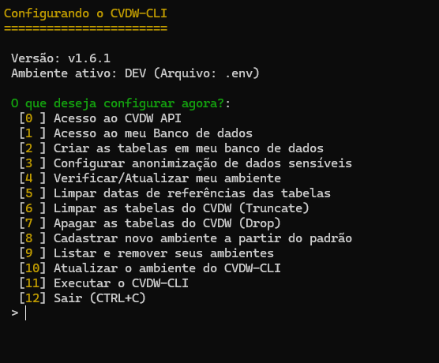
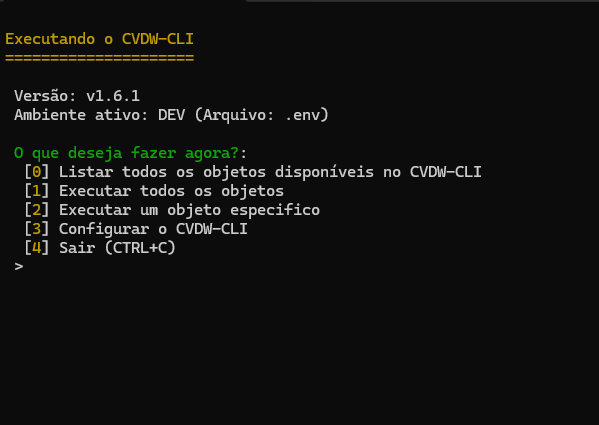

# Guia de Uso do CVDW-CLI

Siga as instruções para configurar e executar o CVDW-CLI em seu ambiente.

---

## Configurar o CVDW-CLI

Após a instalação do CVDW-CLI, será necessário realizar a configuração inicial para que ele funcione corretamente. Utilize o comando abaixo:

```console
cvdw configurar
```

Após executar o comando, será exibido o painel de configuração:



Na tela de configuração, você encontrará informações sobre a versão do CVDW-CLI e o ambiente ativo. As opções para configurar seu ambiente estão listadas a seguir:

### 0. Acesso ao CVDW API
Preencha os seguintes campos:
- Subdomínio do ambiente CV
- E-mail de acesso
- Token de acesso

Essa é a primeira etapa da configuração inicial.

### 1. Acesso ao Banco de Dados
Informe as credenciais do banco de dados onde deseja criar e alimentar as tabelas. Essa é a segunda etapa da configuração inicial.

### 2. Criar Tabelas no Banco de Dados
Com o ambiente devidamente configurado, selecione esta opção para criar automaticamente as tabelas no banco de dados. Essa é a terceira etapa da configuração inicial.

### 3. Configurar Anonimização de Dados Sensíveis
Escolha como os dados sensíveis do banco de dados serão tratados e anonimizados. Este passo é optativo.

### 4. Verificar/Atualizar o Ambiente
Esta opção deverá ser utilizada para atualizar o ambiente com novas colunas/tabelas ou alterar o domínio apontado. Realize essa verificação após configurar a anonimização dos dados.

### 5. Limpar Datas de Referência das Tabelas
Essa opção limpa as datas de referência das tabelas do banco de dados e permite que a inserção seja atualizada do primeiro registro da tabela.

### 6. Limpar Tabelas do CVDW (Truncate)
Utilize esta opção para limpar todos os dados das tabelas ou de uma tabela específica, fornecendo o nome correto. Use com cautela. Somente os dados contidos na tabela

### 7. Apagar Tabelas do CVDW (Drop)
Essa opção permite apagar todas as tabelas ou uma tabela específica do banco de dados. Tenha cuidado, pois essa ação é irreversível. Faz-se necessário usar a opção 2 após essa ação.

### 8. Cadastrar Novo Ambiente a Partir do Padrão
Permite cadastrar um novo ambiente baseado em um padrão já existente.

### 9. Listar e Remover Ambientes
Use esta opção para listar ou remover ambientes configurados.

### 10. Atualizar o CVDW-CLI
Atualize o CVDW-CLI para a versão mais recente. Caso encontre problemas, utilize o comando alternativo:

```console
curl -sSL https://raw.githubusercontent.com/manzano/cvdw-cli/main/install.sh | bash
```

### 11. Executar o CVDW-CLI
Essa opção redireciona para a tela de execução do CVDW-CLI.

---

## Executar o CVDW-CLI

Após configurar o ambiente, inicie a execução das tabelas para alimentá-las com dados.



Na tela de execução, você encontrará as seguintes opções:

### 0. Listar Todos os Objetos Disponíveis
Exibe uma lista de todas as tabelas disponíveis no ambiente configurado.

### 1. Executar Todos os Objetos
Processa e alimenta todas as tabelas de uma vez. A primeira execução pode demorar mais tempo, mas as próximas serão mais rápidas.

### 2. Executar um Objeto Específico
Permite selecionar e processar uma tabela específica. Após escolher esta opção, será exibida uma lista de objetos para você selecionar a tabela desejada.

### 3. Configurar o CVDW-CLI
Redireciona diretamente para a tela de configuração do CVDW-CLI.

---

