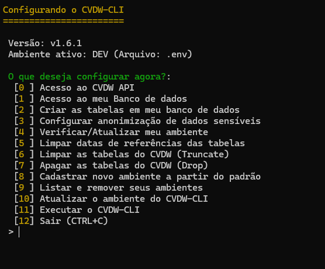

# CVDW-CLI

[](https://sonarcloud.io/summary/new_code?id=manzano_cvdw-cli)

[](https://sonarcloud.io/summary/new_code?id=manzano_cvdw-cli)

[](https://sonarcloud.io/summary/new_code?id=manzano_cvdw-cli)

[](https://sonarcloud.io/summary/new_code?id=manzano_cvdw-cli)

[](https://sonarcloud.io/summary/new_code?id=manzano_cvdw-cli)

O **CVDW Command-line Interface (cvdw-cli)** é uma ferramenta poderosa projetada para facilitar a busca de informações nas APIs do [CV CRM](https://www.cvcrm.com.br) e salvar em um banco de dados, seja local ou remoto. Isso torna a ferramenta extremamente útil para a criação de dashboards e análise de dados.


## Banco de Dados Compatíveis

- MySQL
- MariaDB
- PostgreSQL
- SQL Server

## Pré-requisitos

- PHP >= 8.2
- Composer

## Depois de instalado, atualizando

Depois de instalado, use sempre esse comando para atualizar o CVDW.

```console
curl -sSL https://raw.githubusercontent.com/manzano/cvdw-cli/main/install.sh | bash
```

## Instalação

Para instalar o CVDW-cli, siga as [instruções de instalação](Install.md).

## Configurando

```console
cvdw configurar [-env|--set-env [SET-ENV]]
```

* `--set-env` `-env` — Diz qual ENV usar. Exemplo: dev, homologacao, producao.



## Executando
Agora sim, podemos executar...

```console
cvdw executar [-idr|--ignorar-data-referencia] [-log|--salvarlog] [-env|--set-env [SET-ENV]] [-qtd|--set-qtd [SET-QTD]] [-a|--apartir [APARTIR]] [-m|--max-pag [MAX-PAG]] [--] [<objeto>]
```

* `--ignorar-data-referencia` `-idr` — Ignorar a data de referência.
* `--salvarlog` `-log` — Salvar Log da execução no diretorio de instalação.
* `--set-env` `-env` — Diz qual ENV usar. Exemplo: dev, homologacao, producao.
* `--set-qtd` `-qtd` — Quantidade de dados retornada por cada requisicao.
* `--apartir` `-a` — Consultar a partir de uma data de referencia especifica.

                No formato: Y-m-d\TH:i:s ou Y-m-d.
* `--max-pag` `-m` — Executa o número máximo de página informado.
* `<objeto>` Qual objeto deseja executar


### Selecionando objetos
Você pode selecionar quais objetos quer executar.
Use "+" para informa-los. 

```console
cvdw executar reservas+leads+atendimentos
```

### Relação de objetos disponíveis

| Nome                                      | Comando                             |
|-------------------------------------------|-------------------------------------|
| Agendamentos (/agendamentos/vistorias)    | agendamentos_vistorias              |
| Assistências (/assistencias)              | assistencias                        |
| Assistências (/assistencias/itens)        | assistencias_itens                  |
| Assistências (/assistencias/itens/workflow/tempo)| assistencias_itens_workflow_tempo|
| Assistências (/assistencias/visitas/workflow/tempo)| assistencias_visitas_workflow_tempo|
| Assistências (/assistencias/workflow/tempo)| assistencias_workflow_tempo        |
| Atendimentos (/atendimentos)              | atendimentos                        |
| Atendimentos (/atendimentos/interacoes)   | atendimentos_interacoes             |
| Atendimentos (/atendimentos/respostas)    | atendimentos_respostas              |
| Atendimentos (/atendimentos/tarefas)      | atendimentos_tarefas                |
| Atendimentos (/atendimentos/times)        | atendimentos_times                  |
| Atendimentos (/atendimentos/times/integrantes)| atendimentos_times_integrantes   |
| Atendimentos (/atendimentos/workflow/tempo)| atendimentos_workflow_tempo         |
| Campos Adicionais (/campos_adicionais)    | campos_adicionais                   |
| Campanhas de Ativação (/campanhas_ativacao)| campanhas_ativacao                 |
| Comissões (/comissoes)                    | comissoes                           |
| Comissões (/comissoes/pagamentos)         | comissoes_pagamentos                |
| Comissões (/comissoes/workflow/tempo)     | comissoes_workflow_tempo            |
| Corretores (/corretores)                  | corretores                          |
| Corretores Profissional (/corretores_profissional)| corretores_profissional        |
| Demandas (/demandas)                      | demandas                            |
| Distratos (/distratos)                    | distratos                           |
| Imobiliarias (/imobiliarias)              | imobiliarias                        |
| Leads (/leads)                            | leads                               |
| Leads (/leads/conversoes)                 | leads_conversoes                    |
| Leads (/leads/corretores)                 | leads_corretores                    |
| Leads (/leads/ganhos)                     | leads_ganhos                        |
| Leads (/leads/historico/situacoes)        | leads_historico_situacoes           |
| Leads (/leads/infos)                      | leads_infos                         |
| Leads (/leads/interacoes)                 | leads_interacoes                    |
| Leads (/leads/momentos)                   | leads_momentos                      |
| Leads (/leads/perdas)                     | leads_perdas                        |
| Leads (/leads/tarefas)                    | leads_tarefas                       |
| Leads (/leads/visitas)                    | leads_visitas                       |
| Leads (/leads/workflow/tempo)             | leads_workflow_tempo                |
| Pessoas (/pessoas)                        | pessoas                             |
| Pessoas (/pessoas/bancarios)              | pessoas_bancarios                   |
| Pessoas (/pessoas/bens-empresa)           | pessoas_bens_empresa                |
| Pessoas (/pessoas/contatos)               | pessoas_contatos                    |
| Pessoas (/pessoas/financeiros)            | pessoas_financeiros                 |
| Pessoas (/pessoas/patrimoniais)           | pessoas_patrimoniais                |
| Pessoas (/pessoas/profissional)           | pessoas_profissional                |
| Pesquisas (/pesquisas)                    | pesquisas                           |
| Pesquisas (/pesquisas/perguntas)          | pesquisas_perguntas                 |
| Pesquisas (/pesquisas/respostas)          | pesquisas_respostas                 |
| Pre-cadastro (/precadastros)              | precadastros                        |
| Pre-cadastro (/precadastro/historico/situacoes)| precadastro_historico_situacoes |
| Pre-cadastro (/precadastro/workflow/tempo)| precadastro_workflow_tempo          |
| Processos (/processos)                    | processos                           |
| Reservas (/reservas)                      | reservas                            |
| Reservas (/reservas/associados)           | reservas_associados                 |
| Reservas (/reservas/campos-adicionais)    | reservas_campos_adicionais          |
| Reservas (/reservas/comissoes)            | reservas_comissoes                  |
| Reservas (/reservas/comissoes/programacao)| reservas_comissoes_programacao      |
| Reservas (/reservas/condicoes)            | reservas_condicoes                  |
| Reservas (/reservas/contratos)            | reservas_contratos                  |
| Reservas (/reservas/coordenador)          | reservas_coordenador                |
| Reservas (/reservas/historico)            | reservas_historico                  |
| Reservas (/reservas/historico/situacoes)  | reservas_historico_situacoes        |
| Reservas (/reservas/registros/flags)      | reservas_registros_flags            |
| Reservas (/reservas/sienge)               | reservas_sienge                     |
| Reservas (/reservas/workflow/tempo)       | reservas_workflow_tempo             |
| Repasses (/repasses)                      | repasses                            |
| Repasses (/repasses/historico/situacoes)  | repasses_historico_situacoes        |
| Repasses (/repasses/workflow/tempo)       | repasses_workflow_tempo             |
| Simulações (/simulacoes)                  | simulacoes                          |
| Unidades (/unidades)                      | unidades                            |
| Unidades (/unidades/precos)               | unidades_precos                     |
| Usuários Administrativos (/usuarios_administrativos)| usuarios_administrativos    |
| Vendas (/vendas)                          | vendas                              |


## Contribuição

Contribuições para o projeto são bem-vindas! Se você deseja contribuir, por favor, siga as [instruções de contribuição](Developer.md).

## Guia de Uso 

Após o processo de instalação, por favor, siga o [guia de uso](Guia_Uso.md).

## Licença

Este projeto está licenciado sob a Licença MIT - veja o arquivo [LICENSE](LICENSE) para detalhes.

